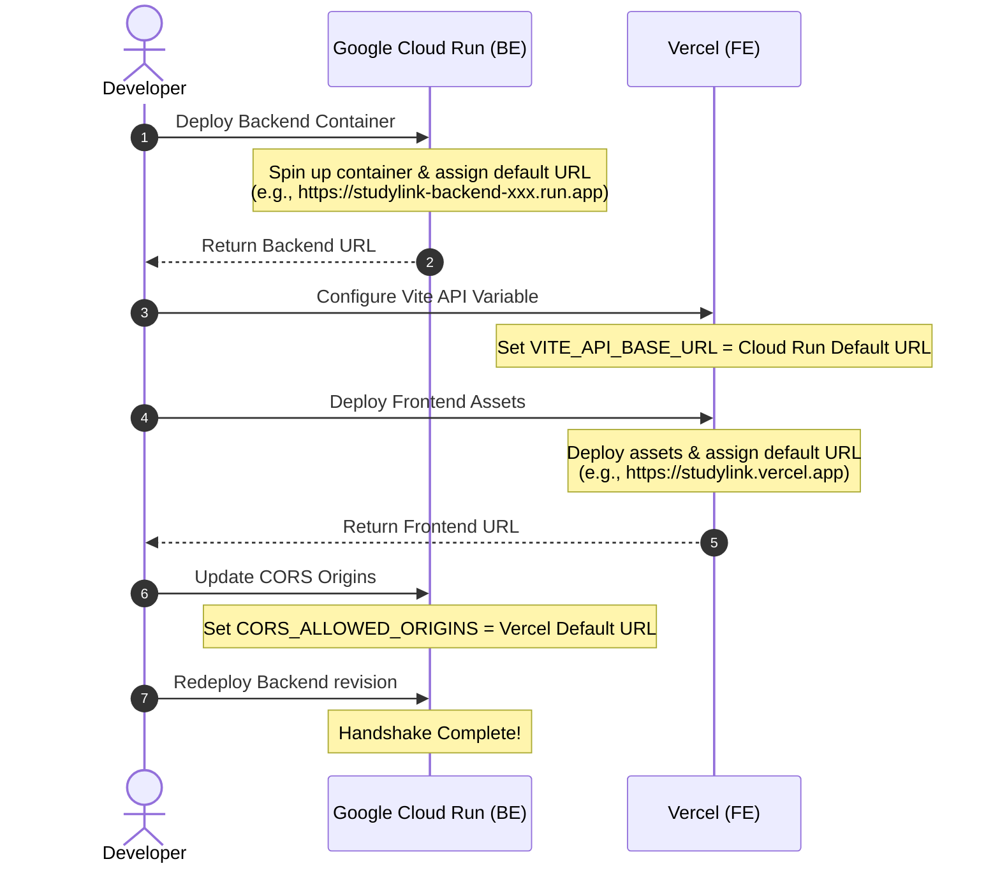

# Phase 11 — Deployment Preparation

This phase covers the configuration and build setups required before releasing **StudyLink** to production. It implements Docker build configurations, environment variable strategies, Cloud Run setup scripts, Vercel monorepo configurations, and the CORS handshake protocol using default service deployment URLs.

---

## 1. Module Design: Infrastructure & Cloud Configuration

### 1.1 Directory Structure
```text
StudyLink/ (Monorepo Root)
├── vercel.json                 # Vercel monorepo configuration
├── backend/
│   ├── Dockerfile              # Docker build settings for Django
│   ├── .dockerignore
│   └── config/
│       ├── settings_prod.py    # Production settings override
│       └── wsgi.py
└── frontend/
    └── vercel.json             # Frontend routing configurations
```

### 1.2 Purpose
Configures the code workspace for serverless container deployment on Google Cloud Run and static hosting on Vercel using default platform domains (`*.run.app` and `*.vercel.app`).

### 1.3 Dependencies
- Docker
- Gcloud SDK (GCP Command line tools)

---

## 2. Implementation Tasks

### 2.1 Django Backend Layer (`backend/`)

#### Feature: Containerization & Cloud Run configurations
Build production deployment assets.

##### Task 11.01.01: Create Production Dockerfile for Django Backend
- **Estimated Size:** S
- **Risk:** Low
- **Prerequisites:** Phase 01 complete
- **Task Description:** Write a `backend/Dockerfile` using `python:3.12-slim`. Install system dependencies, copy requirements, run `pip install`, copy the backend application code, and configure `gunicorn` to start the app.
- **Definition of Done:**
  - Running `docker build -t studylink-backend ./backend` builds the container image successfully.

##### Task 11.01.02: Implement Production Settings Override
- **Estimated Size:** M
- **Risk:** Medium
- **Prerequisites:** Phase 01 complete
- **Task Description:** Create `backend/config/settings_prod.py` (or add conditional checks in `settings.py`). Configure settings:
  - `DEBUG = False`
  - `ALLOWED_HOSTS = ['.run.app', 'localhost', '127.0.0.1']`
  - `SECURE_SSL_REDIRECT = True`
  - `SESSION_COOKIE_SECURE = True`
  - `CSRF_COOKIE_SECURE = True`
  - Read secrets (database URL, API keys, JWT secret) from environment variables.
- **Definition of Done:**
  - Django starts in production mode with standard security settings enabled.

##### Task 11.01.03: Configure CORS & CORS Handshake domains
- **Estimated Size:** S
- **Risk:** Low
- **Prerequisites:** Task 11.01.02
- **Task Description:** Install `django-cors-headers`. In `settings.py`, configure `CORS_ALLOWED_ORIGINS` to read Vercel default production (`https://<project>.vercel.app`) and preview domains from environment variables.
- **Definition of Done:**
  - Requests from allowed Vercel origins are processed correctly, while requests from unlisted domains are blocked.

---

### 2.2 React Frontend Layer (`frontend/`)

#### Feature: Vercel Monorepo Configuration
Configure build settings for monorepos.

##### Task 11.02.01: Create Vercel Monorepo configuration
- **Estimated Size:** S
- **Risk:** Low
- **Prerequisites:** Phase 01 complete
- **Task Description:** Create `vercel.json` in the monorepo root. Configure Vercel to look inside the `frontend/` directory, set the build command to `npm run build`, and configure the output directory to `dist`.
- **Definition of Done:**
  - Build settings map correctly to the monorepo directory layout.

##### Task 11.02.02: Configure API base URL environment variable
- **Estimated Size:** S
- **Risk:** Low
- **Prerequisites:** Phase 09 complete
- **Task Description:** Configure `VITE_API_BASE_URL` in the frontend build settings to point to the Cloud Run backend default URL (`https://<service-name>-<hash>.run.app`).
- **Definition of Done:**
  - Frontend requests route to the Cloud Run backend API URL.

---

### 2.3 Handshake Protocol: Deployment Sequence
To connect the backend and frontend services, deploy them in this order:


