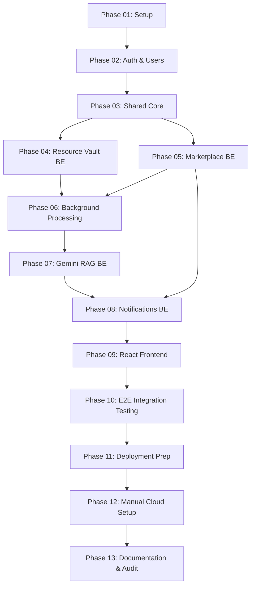
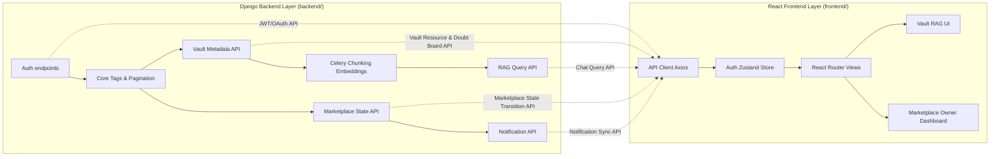

# StudyLink Implementation Roadmap Index

Welcome to the **StudyLink Implementation Roadmap**. This index maps out the sequential execution strategy for a single developer to build StudyLink—a portfolio-quality full-stack SaaS application.

---

## 1. Phase Ordering & Document Links

Below is the execution sequence. Each phase is documented in its own file with fine-grained implementation tasks.

| Phase | Title | Focus Area | Link |
| :--- | :--- | :--- | :--- |
| **Phase 01** | Project Setup | Monorepo structure, folder scaffolding, and workspace dependencies | [Phase_01_Project_Setup.md](file:///d:/Coding/Projects----For%20Resume/StudyLink/Docs/roadmap/Phase_01_Project_Setup.md) |
| **Phase 02** | Authentication & Users | Django custom user, SimpleJWT, social login endpoints, and account linking | [Phase_02_Authentication.md](file:///d:/Coding/Projects----For%20Resume/StudyLink/Docs/roadmap/Phase_02_Authentication.md) |
| **Phase 03** | Shared Core Infrastructure | Subject/Course Tag models, base pagination, global exception filtering | [Phase_03_Shared_Core.md](file:///d:/Coding/Projects----For%20Resume/StudyLink/Docs/roadmap/Phase_03_Shared_Core.md) |
| **Phase 04** | Resource Vault Backend | Notes and PDF uploads, upvote/rating triggers, Doubt Board comments | [Phase_04_Resource_Vault.md](file:///d:/Coding/Projects----For%20Resume/StudyLink/Docs/roadmap/Phase_04_Resource_Vault.md) |
| **Phase 05** | Marketplace Backend | Listings, requests, state transitions, pessimistic concurrency locks | [Phase_05_Marketplace.md](file:///d:/Coding/Projects----For%20Resume/StudyLink/Docs/roadmap/Phase_05_Marketplace.md) |
| **Phase 06** | Background Processing | Celery + Redis setup, queues, ingestion workers, retry configurations | [Phase_06_Background_Processing.md](file:///d:/Coding/Projects----For%20Resume/StudyLink/Docs/roadmap/Phase_06_Background_Processing.md) |
| **Phase 07** | Gemini RAG Ingestion & API | LangChain chunking, Gemini embeddings, pgvector query, and citations | [Phase_07_Gemini_RAG.md](file:///d:/Coding/Projects----For%20Resume/StudyLink/Docs/roadmap/Phase_07_Gemini_RAG.md) |
| **Phase 08** | Notification Engine | In-app alerts, Celery triggers for marketplace requests/upvotes | [Phase_08_Notifications.md](file:///d:/Coding/Projects----For%20Resume/StudyLink/Docs/roadmap/Phase_08_Notifications.md) |
| **Phase 09** | React Frontend UI | Zustand state stores, React Router 6, Vault RAG UI, Marketplace Dashboard | [Phase_09_React_Frontend.md](file:///d:/Coding/Projects----For%20Resume/StudyLink/Docs/roadmap/Phase_09_React_Frontend.md) |
| **Phase 10** | Integration Testing | End-to-End simulation tests, OAuth mocking, RAG/State verification | [Phase_10_Integration_Testing.md](file:///d:/Coding/Projects----For%20Resume/StudyLink/Docs/roadmap/Phase_10_Integration_Testing.md) |
| **Phase 11** | Deployment Prep | CORS configurations, Cloud Run Docker settings, Vercel root scopes | [Phase_11_Deployment_Preparation.md](file:///d:/Coding/Projects----For%20Resume/StudyLink/Docs/roadmap/Phase_11_Deployment_Preparation.md) |
| **Phase 12** | Manual Cloud Setup | Anti-Gravity assisted manual step-by-step instructions for GCP, Supabase, OAuth | [Phase_12_Manual_Deployment.md](file:///d:/Coding/Projects----For%20Resume/StudyLink/Docs/roadmap/Phase_12_Manual_Deployment.md) |
| **Phase 13** | Audit & Handover | Project README audits, API swagger verifications, developer handoff | [Phase_13_Documentation.md](file:///d:/Coding/Projects----For%20Resume/StudyLink/Docs/roadmap/Phase_13_Documentation.md) |

---

## 2. Dependency Graphs

### 2.1 Module Dependency Graph
This graph details how the logical modules within the monorepo rely on one another. The backend core foundations are built first, followed by feature verticals, async execution nodes, and finally the unified React frontend.

### 2.2 Layer Dependency Graph (Monorepo Scope)
Although both layers live in the same repository (`backend/` and `frontend/`), their development is strictly decoupled. Communication between them is restricted to the documented API contract.

---

## 3. Milestones & Stable Checkpoints

At the end of each milestone, the application must be in a stable, runnable, and testable state.

### Milestone 1: Identity & Foundation (End of Phase 03)
*   **Completed Functionality:** Local JWT registration and login, Google/GitHub OAuth account linking logic, Database base schema with Subject/Course models.
*   **Demonstrable Features:** Authenticating via Postman/cURL, generating access/refresh tokens, linking account when login email matches existing local user.
*   **Testable Behavior:** Unit tests for CustomUser Manager, JWT issuance tokens, validation rules for authentication.
*   **Remaining Work:** Data vault uploading, marketplace listing state transitions, background embeddings, React UI.

### Milestone 2: Feature Verticals & Persistence (End of Phase 05)
*   **Completed Functionality:** Digital resource uploading with storage in Supabase S3, upvote triggers, Doubt Board thread posts, Marketplace listing creation, request creation, state transitions with database-level pessimistic lock guards.
*   **Demonstrable Features:** Running API requests to upload a PDF (metadata saved, file streamed to Supabase), calling marketplace transitions `/api/market/requests/{id}/accept/` resulting in listing transitioning to `REQUESTED`.
*   **Testable Behavior:** Unit tests checking that listing statuses cannot double-lock (concurrency checks), listing status histories are correctly written, only owner can accept/cancel request.
*   **Remaining Work:** Ingestion chunking & vectorization (Celery), RAG Chat API, frontend client views.

### Milestone 3: Async Engine & RAG Retrieval (End of Phase 08)
*   **Completed Functionality:** PDF extraction & text chunking using LangChain recursively, Gemini embeddings storing in Supabase PostgreSQL `pgvector` index, similarity queries strictly scoped by `resource_id`, citation mappings, asynchronous notification dispatching via Celery worker.
*   **Demonstrable Features:** Uploading a PDF triggers a Celery worker that populates `resource_chunks` table with vectors. Chatting with notes via `POST /api/v1/chat/query/` yields a context-backed LLM answer with page numbers.
*   **Testable Behavior:** Mocked Gemini embedding tests, vector retrieval scoring checks, notifications correctly dispatched to target receivers' inboxes.
*   **Remaining Work:** React frontend implementation, deployment preparation.

### Milestone 4: Frontend Client & End-to-End flows (End of Phase 10)
*   **Completed Functionality:** React single page app with Zustand state stores, unified filtering sidebars, Doubt Board interface, Chat bubble layout with source page excerpts, Marketplace dashboard with owner accept/cancel panels.
*   **Demonstrable Features:** End-to-end user flows in local browser: signing up, uploading a PDF, waiting for status `READY`, asking a question in the chat panel, listing a physical textbook in the marketplace, requesting it from a different account, and accepting the request in the owner dashboard.
*   **Testable Behavior:** E2E integration test suite simulating full transaction lifecycles.
*   **Remaining Work:** Cloud deployments.

### Milestone 5: Production Deployment & Handover (End of Phase 13)
*   **Completed Functionality:** Containerized Django backend running on GCP Cloud Run, React assets compiled and hosted on Vercel, Supabase DB & Storage in production mode.
*   **Demonstrable Features:** Live staging URLs (`vercel.app` and `run.app`) securely interacting over SSL with working JWTs, OAuth login, PDF ingestion, and RAG chats.
*   **Testable Behavior:** Final production audit scripts and response latency checks.

---

## 4. Module Complexity Estimations

| Module | Purpose | Lines of Code (Est.) | Complexity Level | Primary Risk |
| :--- | :--- | :--- | :--- | :--- |
| **`accounts`** | Auth & Linking | ~1,200 | **Medium** | OAuth account merging email collision edge cases. |
| **`vault`** | Digital Vault Metadata | ~800 | **Low** | File stream interruptions to Supabase S3 storage. |
| **`market`** | Giveaway State Machine | ~1,500 | **High** | Pessimistic locking race conditions under high request concurrency. |
| **`celery_tasks`** | Ingest queues | ~600 | **Medium** | Celery worker resource limits and Redis link dropouts. |
| **`rag_engine`** | RAG retrieval | ~1,100 | **High** | Un-OCR'd scanned PDF exceptions and Gemini context size bounds. |
| **`frontend_ui`** | SPA Views & State | ~4,500 | **Medium** | Zustand state synchronization across multiple dashboard components. |

---

## 5. Suggested GitHub Epics & Issues

### Epic 1: Scaffold & Authentication Foundation (`[Epic] Auth-Base`)
- **Issue 1.1:** Initialize Monorepo Scaffolding (`backend/` and `frontend/`)
- **Issue 1.2:** Configure Django settings, Supabase Dev DB connection pool, and test migrations
- **Issue 1.3:** Implement CustomUser Model and SimpleJWT integration
- **Issue 1.4:** Create Google & GitHub OAuth endpoints with local Account Linking Logic

### Epic 2: Resource Vault & Digital Repository (`[Epic] Vault-BE`)
- **Issue 2.1:** Implement Resource model, migrations, and Supabase S3 upload integration
- **Issue 2.2:** Create Resource list/detail views with subject/course filters
- **Issue 2.3:** Build Doubt Board threaded comment model and discussion API views
- **Issue 2.4:** Build upvote/rating API triggers with denormalized counts

### Epic 3: Marketplace State Machine & Concurrency (`[Epic] Market-BE`)
- **Issue 3.1:** Implement Listing and ListingRequest models and migrations
- **Issue 3.2:** Build Listing status transition services (`Available → Requested → Given Away`)
- **Issue 3.3:** Add database pessimistic locking guards to prevent double-acceptance
- **Issue 3.4:** Write listing status history logger and owner dashboard status APIs

### Epic 4: Async Ingestion & Gemini RAG (`[Epic] RAG-Async`)
- **Issue 4.1:** Scaffold Celery worker environment with Redis queue and retry settings
- **Issue 4.2:** Implement PDF recursive chunking text extractor
- **Issue 4.3:** Build Gemini embedding service and HNSW pgvector database queries
- **Issue 4.4:** Write chat Query API with citations and query scoring threshold bounds

### Epic 5: Notification Service (`[Epic] Notification-BE`)
- **Issue 5.1:** Create Notification model and inbox schema
- **Issue 5.2:** Implement async Celery triggers for marketplace state changes
- **Issue 5.3:** Create user notification lists and read-status toggle endpoints

### Epic 6: React Frontend Interface (`[Epic] Frontend-UI`)
- **Issue 6.1:** Bootstrap React app, Zustand state stores, and Tailwind configurations
- **Issue 6.2:** Create Auth flows (Login, Sign-up, OAuth handling and linking)
- **Issue 6.3:** Build Resource Vault dashboard, PDF Viewer, and scoped Chat sidebar
- **Issue 6.4:** Implement Marketplace classifieds, Listing creation, and Owner management dashboard

### Epic 7: Production Release & Operations (`[Epic] Devops-Prod`)
- **Issue 7.1:** Configure production Docker files, CORS domains, and Cloud Run profiles
- **Issue 7.2:** Step-by-Step GCP, Supabase buckets, OAuth Consent, and Vercel setup (Anti-Gravity Assisted)
- **Issue 7.3:** Write READMEs, API swagger schema documents, and execute final audit checklists

---

## 6. Suggested Git Commit Boundaries

To maintain a clean history, follow this commit structure:
- **`feat(setup): initialize monorepo directories and base django settings`**
- **`feat(accounts): implement custom user model and simplejwt backend auth`**
- **`feat(accounts): add google and github oauth with account linking handlers`**
- **`feat(core): implement core subject/course tags and global pagination`**
- **`feat(vault): add resource uploads and supabase s3 storage integrations`**
- **`feat(vault): build doubt board threaded comments and resource upvotes`**
- **`feat(market): design listing models and state transition service layer`**
- **`feat(market): implement select_for_update concurrency lock on listing acceptance`**
- **`feat(celery): configure celery redis worker tasks and retry behaviors`**
- **`feat(rag): implement recursive character text splitter and gemini embeddings`**
- **`feat(rag): build pgvector similarity query api and source citation builder`**
- **`feat(notify): add notification db triggers and inbox query api`**
- **`feat(frontend): scaffold react, react-router, tailwind, and zustand auth store`**
- **`feat(frontend): implement resource vault view with pdf chat panels`**
- **`feat(frontend): design marketplace view and owner management dashboards`**
- **`test(e2e): implement integration end-to-end simulator suite`**
- **`chore(ops): write dockerfiles and cloud run / vercel environment configurations`**

---

## 7. Testing & Quality Checkpoints

After each milestone, run the following verification checks:
1. **Linter Check:** Run `flake8` for backend and `eslint` for frontend to verify clean syntax rules.
2. **Database Migration Consistency:** Ensure no dev migrations are left unapplied. Execute `python manage.py makemigrations --check`.
3. **Unit Test Pass Rate:** Run `pytest` / `python manage.py test` to ensure 100% test coverage pass rate.
4. **Environment Isolation Check:** Validate that credentials are read from `.env` files and never hard-coded in files.

Proceed to the individual phase documents listed in Section 1 to begin step-by-step implementation.
