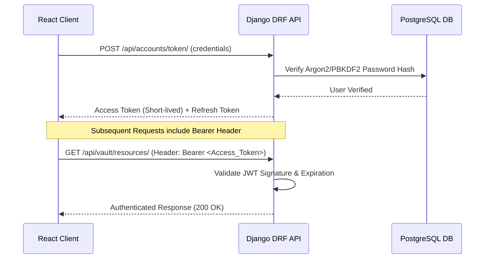

# 03 — Security Architecture & Threat Modeling

## Overview

Security architecture in **StudyLink** is designed around zero-trust API boundaries, object-level access control, data encryption, and vector retrieval isolation. This document outlines the security concepts, threat model, and mitigation strategies implemented across the codebase.

---

## 1. Threat Model & Risk Matrix

| Threat Vector | Potential Impact | Mitigation Strategy Implemented |
| :--- | :--- | :--- |
| **Unauthorized Data Access** | Information Disclosure | SimpleJWT authentication + DRF object-level `IsOwnerOrReadOnly` permissions |
| **Marketplace Race Conditions** | State Corruption / Double Claim | Pessimistic database row locking (`SELECT FOR UPDATE`) in `market.services` |
| **RAG Prompt Injection** | Model Misbehavior / Data Leakage | System prompt demarcation separating untrusted context from model instructions |
| **Cross-Tenant Vector Retrieval** | Document Leakage | Parameterized SQL query filters constraining vector similarity to `resource_id` |
| **Credential & Secret Exposure** | Account Takeover | Zero hardcoded keys; runtime environment variable injection via Cloud Secret Manager |
| **Man-in-the-Middle (MitM)** | Traffic Eavesdropping | TLS 1.3 encryption across Cloud Run, Vercel, Supabase Postgres, and S3 |

---

## 2. Authentication & JWT Hardening

---

## 3. Database & pgvector Security

1. **Prepared Statements**: All vector searches in `rag/search.py` use parameterized queries to prevent SQL injection.
2. **Postgres TLS Enforcement**: Connections to remote Supabase instances require `sslmode=require`.
3. **Least Privilege Database User**: Application database user is restricted to schema operations (`SELECT`, `INSERT`, `UPDATE`, `DELETE`) without DDL superuser privileges.

---

## 4. Production Security Checklist

- [x] SimpleJWT token blacklisting enabled on logout.
- [x] `SECRET_KEY` pulled from environment variable (never committed).
- [x] `DEBUG=False` in production deployment.
- [x] `ALLOWED_HOSTS` and `CORS_ALLOWED_ORIGINS` explicitly restricted.
- [x] Docker multi-stage build running non-root container.
- [x] MIT License & Security Policy (`SECURITY.md`) included in root repository.
